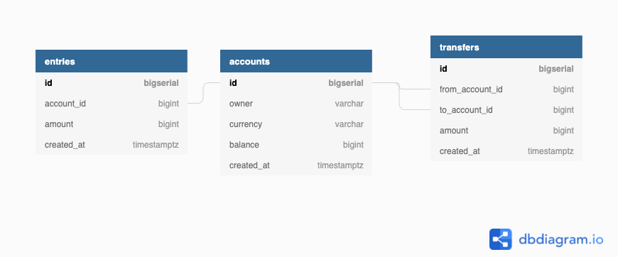

# Bank-Golang
This project I used for learning Go and other techniques to improve my skills.

# Dependencies
- golang-migrate
- sqlc: v1.25.0
- mockgen

# Installation
## 1. [Install golang-migrate](https://github.com/golang-migrate/migrate)
```
brew install golang-migrate
```
We're going to use 3 commands:
- `create`: we can use to create a new migration file.
- `goto`: which will migrate the schema to a specific version
- `up` or `down`: to apply all or N up or down migrations.

Example:
```
migrate create -ext sql -dir db/migration -seq init_schema
```

## 2. [Install sqlc](https://docs.sqlc.dev/en/stable/overview/install.html)
```
brew install sqlc
```

## 3. Install mockgen
```
go install github.com/golang/mock/mockgen@v1.6.0
export PATH=$PATH:~/go/bin
```

Why mock database?
- independent test: avoid conflicts with real data
- faster test:
    we don't need to talk to the database
    all actions will be performed in memory, on the same process
- 100% coverage
    easily setup edge cases: unexpected errors or connection lost
     
How: using stubs instead of fake db
    - fake db(implement a fake version of DB)
-> Using Gomock to mock db

```
mockgen pathToModule/db/sqlc InterfaceName
Example: mockgen -package mockdb -destination db/mock/store.go github.com/cs-tungthanh/Bank_Golang/db/sqlc store
```

# Stages
## 1. Design Database Schema
https://dbdiagram.io/d/6208c1dd85022f4ee584df9c

There are 3 tables:
1. Account table:
- A person can has many accounts but one account only have one currency.

2. Entries table: used for recording all history of changes to the account balance
- One account can have many entries
3. Transfers table:

Indexing to the DB:
- we might want to search an account by owner name
- we might want to retrive all transfer that going out/into of an account




```bash
docker exec -it container-name bash
psql -U root -d simple_bank
```

**Transaction**: bundles multi-steps into a single.

Benefits:
- Make sure Data Integrity

```sql
BEGIN;
UPDATE Table1 ... WHERE name = 'Alice';
SAVEPOINT my_savepoint_label;
UPDATE Table2 ... WHERE name = 'Bob';
-- oops ... forget that and use Wally's account
ROLLBACK TO my_savepoint_label;
UPDATE ... WHERE name = 'Wally';
COMMIT;
```


```sql
BEGIN;

INSERT INTO transfers (from_account_id, to_account_id, amount) VALUES (6,7,10) RETURNING *;

INSERT INTO entries (account_id, amount) VALUES (6, -10) RETURNING *;
INSERT INTO entries (account_id, amount) VALUES (7, 10) RETURNING *;

SELECT * FROM accounts WHERE id = 6 FOR UPDATE;
UPDATE accounts SET balance=689 WHERE id=6 RETURNING *;

SELECT * FROM accounts WHERE id = 7 FOR UPDATE;
UPDATE accounts SET balance=791 WHERE id=7 RETURNING *;

ROLLBACK;
```

## Docker
`docker container inspect postgres12`: to see the network setting
- check NetworkSetting/IPAddress

```bash
docker network ls
docker network create network-name

# to list all containers are running in this network
docker network inspect network-name

# Manual connect: 
docker network connect network-name container
```

- If you have more than 2 containers with non-defined network, it will run in different networks.
- That means each container will run with different IPAddress and cannot connect to each other.
- so we are supposed to attach this container to the same network.
- if all services are defined in the same file docker-compose, it has the same network
- the network is just need when we run seperately container
networks
### Tech
- need to create network first: docker network create bank-network
```
networks:
  bank-network:
    external: true
```


# References
- https://github.com/golang-migrate/migrate#cli-usage
